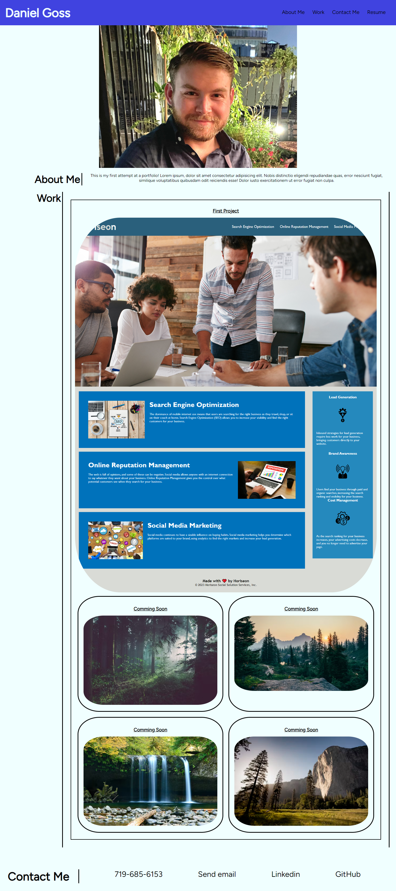

# First-Portfolio

## Description

- I want to build out a profesional portfolio to show to future employers.
- This site is built so that I have a central location for all my future applications.
- I learned that building out my html first before moving on to the css was helpful in better organizing how I wanted to style my application.
- I gained a lot of help by working with Maguire, Erik, and Spencer from my cohort as well as a tutoring session with Bobbi Tarkany. They all were able to help me look through my code and find areas that I was overlooking or simply missing to help debug what was going wrong.

##Screenshot

'''md

## Deployed Application

https://danielgoss22.github.io/First-Portfolio/
